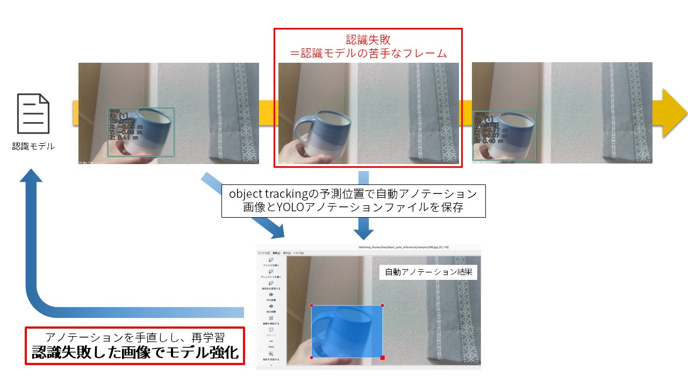

# tracking_annotator

OAK-Dのtracking機能を使い、認識できなかったフレームを自動でYOLOアノテーションし、保存するアプリ

## セットアップ
1. submoduleの更新  
`git submodule update --init`  

1. 仮想環境の作成  
`python3 -m venv venv`  
`. venv/bin/activate`  
`pip install -r requirements.txt`  

## 実行
`python3 tracking_annotator.py -p "画像を保存するディレクトリパス"`
